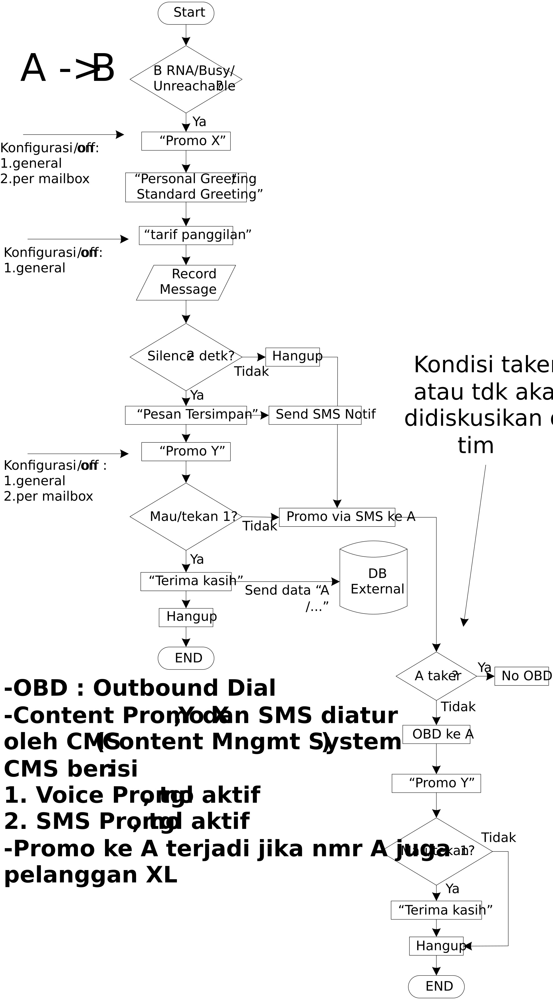

# Leaving
Memakai format JSON

## Flow


## INIT LEAVING
Command: `INITLEAVING`
### Request
Format: `JSON`

| Parameter | Type| value | Description |
| :--- | :--- | :--- | :--- |
| `command` | `string` |INITLEAVING| initial leaving |
| `ip` | `int` |127.0.0.1| ip dari server ivr|
| `ivr_name` | `string` |SBY| nama ivr node |
| `number` | `json` | {<br>&nbsp;&nbsp;&nbsp;"a":"08123456"<br>&nbsp;&nbsp;&nbsp;"b":"08182938"<br>&nbsp;&nbsp;&nbsp;"c":"222"<br>} | info nomor penelepon |

#### Contoh Request
```javascript
{
  "command" : "INITLEAVING",
  "ip" : "127.0.0.1",
  "ivr_name" : "SBY",
  "number"    :  {
					"a":"08123456",
					"b":"08182938",
					"c":"222"
				}
}
```

### Responses
Format JSON
| Parameter | Type| Sample value | Description |
| :--- | :--- | :--- | :--- |
| `status` | `string` | `ok` <br> `error`| proses pengambilan data berhasil<br> `error` proses pengambilan data gagal |
| `record` | `json` |{<br>&nbsp;&nbsp;&nbsp;"status":"on",<br>&nbsp;&nbsp;&nbsp;"max_idle":2,<br>&nbsp;&nbsp;&nbsp;"max_record":10<br>} |value `status`:<br>`on` atau `off` mode active record pesan<br>`max_idle` max idle dalam `second`<br>`max_record` max record dalam `second` |
| `mailbox` | `json` | {<br>&nbsp;&nbsp;&nbsp;"total":2,<br>&nbsp;&nbsp;&nbsp;"max":5<br>}|`total` Total jumlah pada mailbox<br>`Jumlah maksimal mailbox` Jumlah maksimal mailbox |
| `language` | `string` | `ina` <br>`eng`|`ina` bahasa <br>`eng` english |
| `greeting` | `json` | {<br>&nbsp;&nbsp;&nbsp;"type":"default",<br>&nbsp;&nbsp;&nbsp;"voice":"greeting_voice",<br>&nbsp;&nbsp;&nbsp;}|value untuk `type`:<br>`default` dan `personal` <br>kalo `default` value `voice` kosong |
| `play_promo_x` | `json` |{<br>&nbsp;&nbsp;&nbsp;"general":"on",<br>&nbsp;&nbsp;&nbsp;"personal":"on",<br>&nbsp;&nbsp;&nbsp;"voice":"promo_x_voice"<br>}|`general` aktivasi promo x general<br>`personal` aktivasi promo x personal<br>`voice` voice promo<br><br>`general` dan `personal` valuenya `on` atau `off`|
| `play_promo_y` | `json` |{<br>&nbsp;&nbsp;&nbsp;"general":"on",<br>&nbsp;&nbsp;&nbsp;"personal":"on",<br>&nbsp;&nbsp;&nbsp;"voice":"promo_x_voice"<br>}|`general` aktivasi promo x general<br>`personal` aktivasi promo x personal<br>`voice` voice promo<br><br>`general` dan `personal` valuenya `on` atau `off`|
| `play_tarif_call` | `string` | `on`<br>`off`|aktivasi tarif panggilan|


#### Contoh Response
```javascript
{
	"status" : "ok",
	"record_message" : "on",
	"language" : "ina",
	"greeting" : {  
					"type":"personal",  
					"voice":"greeting_voice"
				},
	"play_promo_x":	{  
						"general":"on",  
						"personal":"on",  
						"voice":"promo_x_voice"  
					},
	"play_promo_y:	{  
						"general":"on",  
						"personal":"on",  
						"voice":"promo_x_voice"  
					},
	"play_tarif_call" : "on"				
}
```

## RECORD MAILBOX
Command: `RECMAIL`

### Request
Format: `JSON`

| Parameter | Type| value | Description |
| :--- | :--- | :--- | :--- |
| `command` | `string` |RECMAIL| Record mailbox |
| `ip` | `int` |127.0.0.1| ip dari server ivr|
| `ivr_name` | `string` |SBY| nama ivr node |
| `number` | `json` | {<br>&nbsp;&nbsp;&nbsp;"a":"08123456"<br>&nbsp;&nbsp;&nbsp;"b":"08182938"<br>&nbsp;&nbsp;&nbsp;"c":"222"<br>} | info nomor penelepon |
| `deposit` | `string` | `true`<br>`false` | `true` jika a number merekam suara<br>`false` jika a number tidak merekam suara
| `filename` | `string` | msg_12345_54321 | file voice, jika `deposit` false maka value akan kosong
| `duration` | `int` | 10 | durasi merekam dalam detik, jika `deposit` false maka value akan kosong

#### Contoh Request
```javascript
{
  "command" : "RECMAIL",
  "ip" : "127.0.0.1",
  "ivr_name" : "SBY",
  "number"    :  {
					"a":"08123456",
					"b":"08182938",
					"c":"222"
				,
  "deposit" : true,
  "filename" : "msg_12345_54321",
  "duration" : 5
}
```

### Response
Format: `JSON`

| Parameter | Type| value | Description |
| :--- | :--- | :--- | :--- |
| `status` | `string` | `ok` <br> `error`| `ok` pemrosesan data berhasil<br> `error` pemrosesan data gagal |


#### Contoh Response
```javascript
{
  "status" : "ok",
}
```

## Service

service dibagi 2, leaving dan retrieve:

* [Skenario leaving](skenario/leaving.md) : `Leaving`
* [Skenarion Retrieve](skenario/retreive.md) : `Retrieve`