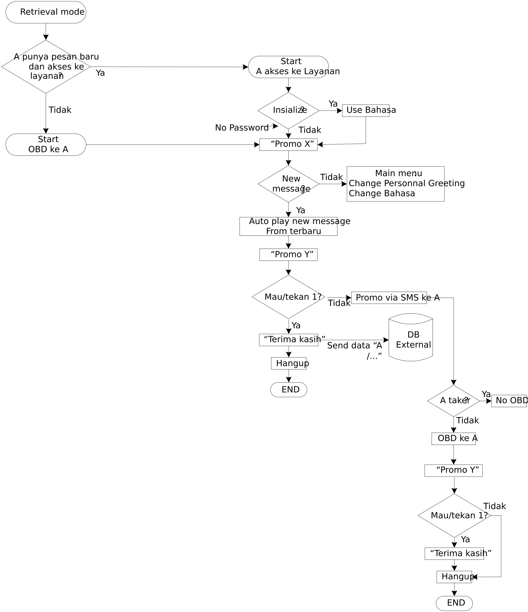

# Retrieve
Memakai format JSON

## Flow


## INIT RETRIEVE
Command: `INITRETRIEVE`
### Request
Format: `JSON`

| Parameter | Type| value | Description |
| :--- | :--- | :--- | :--- |
| `command` | `string` |INITRETRIEVE| initial retrieve |
| `ip` | `int` |127.0.0.1| ip dari server ivr|
| `ivr_name` | `string` |SBY| nama ivr node |
| `number` | `json` | {<br>&nbsp;&nbsp;&nbsp;"a":"08123456"<br>&nbsp;&nbsp;&nbsp;"b":"222"<br>} | info nomor penelepon |

#### Contoh Request
```javascript
{
  "command" : "INITRETRIEVE",
  "ip" : "127.0.0.1",
  "ivr_name" : "SBY",
  "number"    :  {
					"a":"08123456",
					"b":"222"
				}
}
```

### Responses
Format JSON
| Parameter | Type| Sample value | Description |
| :--- | :--- | :--- | :--- |
| `status` | `string` | `ok` <br> `error`| proses pengambilan data berhasil<br> `error` proses pengambilan data gagal |
| `access` | `boolean` | `true`<br>`false` | apakah punya akses|
| `mailbox` | `json` | {<br>&nbsp;&nbsp;&nbsp;"total":5,<br>&nbsp;&nbsp;&nbsp;"read":3,<br>&nbsp;&nbsp;&nbsp;"unread":2<br>}|`total` Total jumlah pada mailbox<br>`read` Jumlah pesan terbaca <br>`unread` Jumlah pesan belum terbaca|
| `message_read` | `json` | `[`{<br>&nbsp;&nbsp;&nbsp"number":"08123",<br>&nbsp;&nbsp;&nbsp;"date":"2020-12-20","voice":"msg_a"<br>},{<br>&nbsp;&nbsp;&nbsp"number":"081245",<br>&nbsp;&nbsp;&nbsp;"date":"2020-12-21","voice":"msg_b"<br>`]`||
| `message_unread` | `json` | `[`{<br>&nbsp;&nbsp;&nbsp"number":"081812",<br>&nbsp;&nbsp;&nbsp;"date":"2020-12-20","voice":"msg_c"<br>},{<br>&nbsp;&nbsp;&nbsp"number":"08181245",<br>&nbsp;&nbsp;&nbsp;"date":"2020-12-24","voice":"msg_d"<br>`]`||
| `language` | `string` | `ina` <br>`eng`|`ina` bahasa <br>`eng` english |
| `play_promo_x` | `json` |{<br>&nbsp;&nbsp;&nbsp;"general":"on",<br>&nbsp;&nbsp;&nbsp;"personal":"on",<br>&nbsp;&nbsp;&nbsp;"voice":"promo_x_voice"<br>}|`general` aktivasi promo x general<br>`personal` aktivasi promo x personal<br>`voice` voice promo<br><br>`general` dan `personal` valuenya `on` atau `off`|
| `play_promo_y` | `json` |{<br>&nbsp;&nbsp;&nbsp;"general":"on",<br>&nbsp;&nbsp;&nbsp;"personal":"on",<br>&nbsp;&nbsp;&nbsp;"voice":"promo_x_voice"<br>}|`general` aktivasi promo x general<br>`personal` aktivasi promo x personal<br>`voice` voice promo<br><br>`general` dan `personal` valuenya `on` atau `off`|
| `personal_greeting`|`json`|{<br>&nbsp;&nbsp;&nbsp;"active":false,<br>&nbsp;&nbsp;&nbsp;"voice":"voice_name"<br>}|file voice personal greeting


#### Contoh Response
```javascript
{
	"status" : "ok",
	"access" : true,
	"language" : "ina",
	"personal_greeting": {
							"active":true,
							"voice":"voice_greeting"
						},
	"mailbox" : {  
					"total":5,  
					"read":3,
					"unread":2
				},
	"message_read" :[ 
				{  
					"number" : "08123445",  
					"date" : "2020-12-20",
					"voice" : "msg_a"
				},
				{  
					"number" : "08132221",  
					"date" : "2020-12-22",
					"voice" : "msg_b"
				}
			],
	"message_unread" :[ 
				{  
					"number" : "08123445",  
					"date" : "2020-12-24",
					"voice" : "msg_c"
				},
				{  
					"number" : "08132221",  
					"date" : "2020-12-25",
					"voice" : "msg_d"
				}
			],
	"play_promo_x":	{  
						"general":"on",  
						"personal":"on",  
						"voice":"promo_x_voice"  
					},
	"play_promo_y:	{  
						"general":"on",  
						"personal":"on",  
						"voice":"promo_x_voice"  
					},}
```

## CONFIG
config ada di bagian ini:
* [Config Profile](config.md) : `Config Profile`

## Service

service dibagi 2, leaving dan retrieve:

* [Skenario leaving](leaving.md) : `Leaving`
* [Skenarion Retrieve](retreive.md) : `Retrieve`